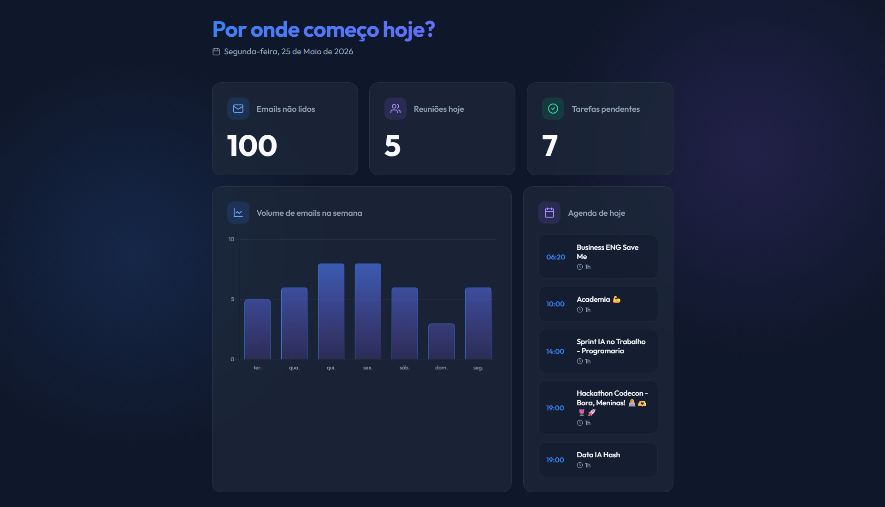
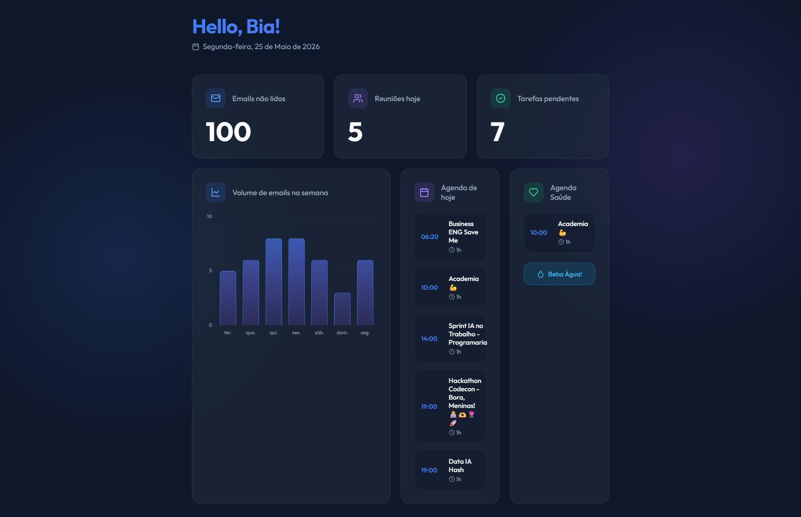
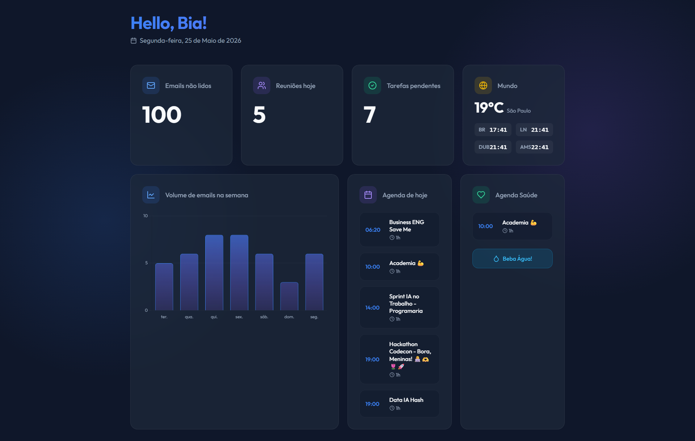

# 🤖 Projeto | Sprint IA no Trabalho — PrograMaria 💜

Projeto desenvolvido durante a **Sprint IA no Trabalho**, iniciativa da **PrograMaria**, organização de impacto social focada na formação, inclusão e fortalecimento de mulheres na tecnologia.

A PrograMaria promove cursos, bootcamps e eventos voltados para diversidade e equidade de gênero no setor de TI, incentivando mais mulheres a ocuparem espaços na área de tecnologia e inovação.

---

# 🤖 Sobre a Sprint IA no Trabalho

A Sprint IA no Trabalho foi um minicurso prático com foco em aplicações reais de Inteligência Artificial no dia a dia profissional.

O programa abordou:
- automação de tarefas,
- produtividade com IA,
- integração entre ferramentas,
- criação de projetos funcionais,
- e uso de IA aplicada a rotinas reais de trabalho.

---

#  Sobre o Projeto

Este projeto foi desenvolvido utilizando conceitos de **Vibe Coding**, com suporte das ferramentas:

- Antigravity
- Gemini Models
- APIs Google
- Inteligência Artificial aplicada à produtividade

O objetivo foi criar um **painel interativo de rotina diária**, integrando APIs do Google para centralizar informações importantes do dia a dia em uma única interface.

---

# 🔗 Funcionalidades

## ✅ Integrações
- Google Calendar API
- Google Gmail API
- Login com autenticação Google

## 📋 Recursos do painel
- Visualização da agenda diária
- Compromissos organizados em tempo real
- Centralização de informações pessoais
- Interface interativa
- Dashboard de produtividade pessoal

---

# 🧪 Versões Desenvolvidas

## 📌 Versão 01 — Padrão (Base da Aula)
Versão inicial desenvolvida durante as atividades da sprint, com foco na integração básica das APIs Google e visualização da agenda.

---

## ❤️ Versão 02 — Saúde - Agenda de saúde integrada com destaque para ela, separadamente.
Expansão do projeto com informações voltadas para rotina e acompanhamento pessoal.

---

## 🌎 Versão 03 — Fusos Horários & Temperatura onde a temperatura me ajuda a planejar meu dia e os fusos horarios me ajudam nas interações diárias com pessoas dos países selecionados. O fuso horário, muitas vezes, pode confundir.

Versão avançada com:
- múltiplos fusos horários,
- previsão/temperatura,
- informações adicionais de contexto para organização da rotina.

---

# 🔮 Próximos Passos

Futuramente, o projeto poderá incluir:
- automações inteligentes,
- lembretes com IA,
- organização automática de rotina,
- análise de produtividade,
- priorização de tarefas,
- insights personalizados,
- integração com outras plataformas.

---

# 🖼️ Preview do Projeto

## 📌 Dashboard Principal

  

---

## 📌 Agenda Integrada

  

---

## 📌 Dashboard Saúde

  

---

# 🛠️ Tecnologias Utilizadas

- Gemini Models
- Antigravity
- Google Calendar API
- Google Gmail API
- HTML
- CSS
- JavaScript
- IA aplicada à produtividade

---

# 👩‍💻 Sobre mim

Sou a Bia ✨  
Profissional apaixonada por Business Intelligence, Analytics e Data Visualization.

Atuo transformando dados e tecnologia em experiências mais claras, visuais e estratégicas, conectando negócio, produtividade e storytelling de forma humana e acessível.

📎 LinkedIn:  
https://linkedin.com/in/biavasconcelos

---

# 💜 PrograMaria

Projeto desenvolvido durante a Sprint IA no Trabalho da comunidade PrograMaria.
